# <div align="center">👋 ¡Hola! Soy **Carlos Antonio** </div>

<div align="center">
  


</div>

<div align="center">
  
</div>

---

## 🌟 **Tecnologías en mi Radar**

<div align="center">
  
  
  
</div>

**🔭 Explorando:**
- 🤖 **IoT Development** - Conectando dispositivos inteligentes
- ☁️ **Cloud Computing** - AWS, Azure para infraestructuras escalables  
- 🔐 **Cybersecurity** - Seguridad en redes y aplicaciones
- 📡 **5G Technologies** - El futuro de las comunicaciones
- 🚀 **Microservicios** - Arquitecturas distribuidas con Spring Boot

---

## 🌐 **Mi Especialidad: Telecomunicaciones & Desarrollo**

<div align="center">
  
  
  
</div>

### **🔧 Tecnologías de Telecomunicaciones:**
<div align="center">

| **Networking** | **Protocolos** | **Herramientas** |
|:--------------:|:--------------:|:----------------:|
| 🌐 TCP/IP Stack | 🔀 BGP, OSPF, EIGRP | 📊 Wireshark |
| 🔌 VLANs, STP | 📞 SIP, VoIP | 🔧 Cisco Packet Tracer |
| 🛡️ NAT/PAT, ACLs | 🏷️ MPLS, QoS | 🖥️ GNS3, Putty |

</div>

<div align="center">
  
</div>

---

## 🚀 **Sobre Mí** 


📠**Ingeniero en Telecomunicaciones** (INACAP, 2022)   
💼 **Back Office Specialist** en Movistar Empresas   
🌱 **Estudiante Bootcamp Full Stack** en Generation Chile ☕  
💙 **Apasionado por el desarrollo Backend con Java**   
🌍 **Concepción, Chile** 🇨🇱  

> *"Conectando el mundo físico con el digital, una línea de código a la vez"* 

<div align="center">
  
[](https://github.com/Carlosssantonio)
[](https://github.com/Carlosssantonio)
[](https://github.com/Carlosssantonio?tab=repositories)


</div>

---

## 💻 **Mi Stack Tecnológico** 

<div align="center">

### **🔥 Desarrollando Actualmente** 


### **🌠Experiencia en Telecomunicaciones** 


</div>

<br>

<div align="center">

| **Backend & Databases** | **Frontend** | **Tools & OS** |
|:------------------------:|:------------:|:--------------:|
|  |  |  |
|  |  |  |
|  |  |  |
|  |  |  |

<div align="center">
  
</div>

</div>

---

## 📊 **GitHub Analytics** 

<div align="center">
  
  
</div>

<div align="center">
  
</div>

<div align="center">
  
</div>

---

## 🚀 **Mis Proyectos Destacados** 

<div align="center">

<a href="https://github.com/Carlosssantonio/mi-cv-futuro">
  
</a>
<a href="https://github.com/Carlosssantonio/clase1">
  
</a>

</div>

<div align="center">

<a href="https://github.com/Carlosssantonio/principioSOLID">
  
</a>
<a href="https://github.com/Carlosssantonio/prueba-TCP-IP">
  
</a>

</div>

---

## 🛣️ **Mi Trayectoria Profesional**

```mermaid
timeline
    title Mi Evolución Profesional
    
    2022 : 🎓 Titulación
         : Ing. Telecomunicaciones
         : INACAP
    
    2023 : 💼 Experiencia Laboral
         : Back Office Movistar
         : Optimización de procesos
         : 15% mejora en eficiencia
    
    2025 : 💻 Bootcamp Full Stack
         : Generation Chile
         : Java, Spring Boot, React
         : Transición al desarrollo
    
    Futuro : 🚀 Desarrollador Full Stack
           : Combinar telecomunicaciones
           : con desarrollo de software
```

<div align="center">
  
</div>



---

## 💼 **Experiencia Profesional**

<div align="center">
  
</div>


### 📡 **Back Office - Wesell Chile (Movistar Empresas)**
*Febrero 2023 - Presente*

🔹 **Optimización de procesos TIC** - Reducción del 15% en tiempos de respuesta  
🔹 **Gestión de CRM ONE** - Creación de perfiles de facturación  
🔹 **Análisis de datos** - Reportes Excel para +200 casos mensuales  
🔹 **Soporte técnico** - Resolución de tickets y ajuste de parámetros  

### 🛠️ **Experiencia Técnica en Telecomunicaciones:**

<div align="center">
  
  
  
</div>

- **Protocolos de Routing:** BGP, OSPF, EIGRP, RIP
- **Tecnologías VoIP:** SIP, Asterisk, Cisco Call Manager  
- **Análisis de redes:** Wireshark, TCP/IP Stack, IPv4/IPv6
- **Certificaciones:** CCNP ROUTE, CCNP TSHOOT

---

## 🎯 **Objetivos 2025**

<div align="center">

| 🎯 **Meta** | 📅 **Timeline** | 🔥 **Estado** |
|-------------|-----------------|---------------|
| ✅ Dominar Java & Spring Boot | Marzo 2025 | 🟡 En progreso |
| 🚀 Primer proyecto Full Stack | Abril 2025 | ⚪ Planificado |
| 💼 Posición como Dev Jr | Junio 2025 | ⚪ Objetivo |
| 🌟 Contribuir Open Source | Agosto 2025 | ⚪ Aspiracional |

</div>

---

## 🧠 **¿Qué me hace único?**

<div align="center">
  
  
  
</div>

```javascript
const carlosAntonio = {
    background: "Telecomunicaciones + Experiencia empresarial",
    currentFocus: "Full Stack Development con Java",
    
    fortalezas: [
        "🔍 Análisis y resolución de problemas complejos",
        "🏢 Experiencia en sistemas empresariales (CRM, SAP)",
        "🌐 Conocimiento profundo de redes y protocolos",
        "💬 Comunicación técnica efectiva",
        "📊 Optimización de procesos (15% de mejora comprobada)"
    ],
    
    vision: "Crear aplicaciones robustas que conecten el mundo físico con el digital",
    objetivo: "Ser el puente entre telecomunicaciones y desarrollo de software",
    
    aprendiendo: ["Java", "Spring Boot", "React", "Node.js"],
    proximoPaso: "Desarrollar proyectos que combinen mi expertise en redes con código"
};

console.log("🚀 Siempre listo para nuevos desafíos!");
```

---

## 📞 **¡Conectemos!**

<div align="center">
  
<a href="https://linkedin.com/in/carlos-antonio-sepulveda" target="_blank">
  
</a>
<a href="mailto:carlos.antonio.dev@gmail.com" target="_blank">
  
</a>
<a href="https://github.com/Carlosssantonio" target="_blank">
  
</a>

**📍 Concepción, Chile** | **🌐 Español (Nativo) | Inglés (B1)** | **💻 Disponible para oportunidades remotas**

</div>

---

<div align="center">
  
**💭 "De configurar routers a programar soluciones"**

*Transformando mi pasión por las telecomunicaciones en código que conecta el futuro*


</div>

---

### ⚡ **Fun Fact del Día**
<div align="center">
  
[](https://github.com/piyushsuthar/github-readme-quotes)

</div>

<div align="center">
  
  
  
</div>
